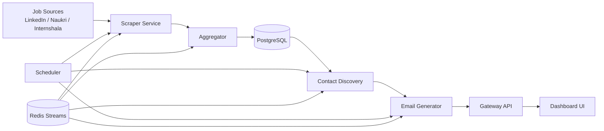
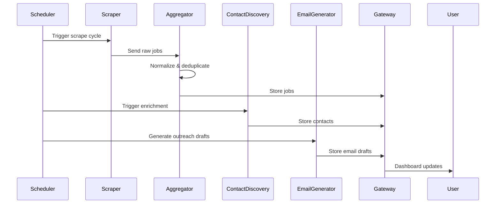
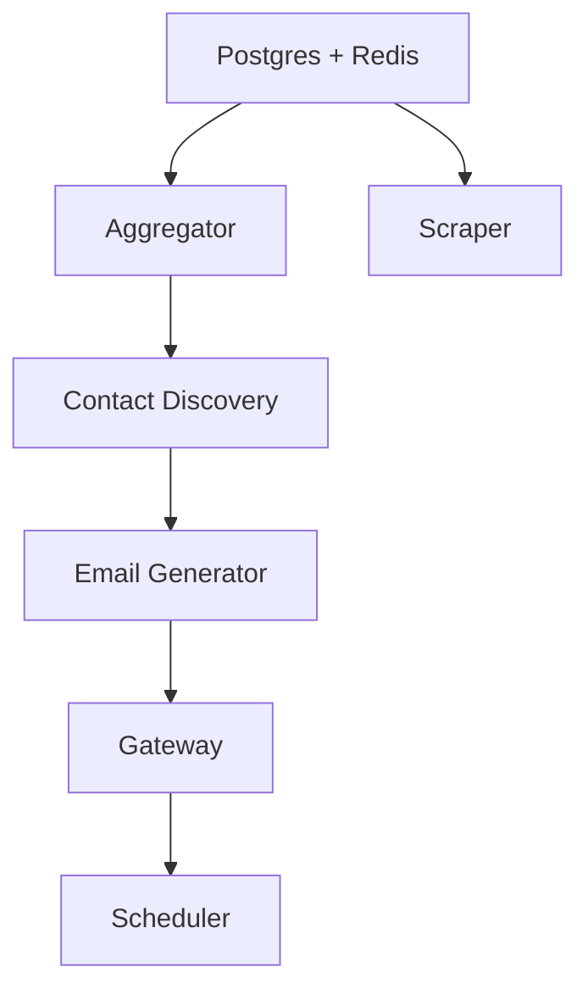
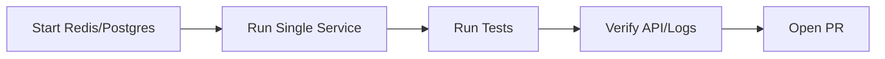

# <div align="center">🌟 CONTRIBUTING TO ARACHNODE 🌟</div>

<div align="center">

### *Self-hosted microservice platform*


</div>

---

# CONTRIBUTING.md

# Contributing to Arachnode 🕷️

Welcome, and thank you for contributing to **Arachnode**.

Arachnode is a self-hosted microservice platform for:

- automated job discovery
- contact enrichment
- cold email generation
- workflow orchestration for engineering job hunts

Built with:

- Python 3.11
- FastAPI
- Scrapy
- Redis
- PostgreSQL
- Docker

---

# Why This Exists

I built Arachnode because manually managing engineering applications at product-based startups was slow, repetitive, and impossible to scale efficiently.

As a third-year student approaching placement season, I needed a way to:

- discover relevant roles automatically
- aggregate jobs from scattered platforms
- identify hiring managers
- generate personalized outreach emails
- automate repetitive application workflows

Arachnode automates the top of the job-hunt funnel so contributors and users can focus on what actually matters:

> interviewing, networking, and shipping.

---

# Contributor Philosophy

We strongly prefer:

✅ small focused PRs  
✅ readable code  
✅ architecture awareness  
✅ documentation updates  
✅ tested changes  
✅ respectful collaboration  

We discourage:

❌ giant refactors without discussion  
❌ drive-by breaking changes  
❌ force pushes during review  
❌ "fix everything" PRs  
❌ untested AI-generated code dumps  

---

# Project Architecture Overview



---

# System Workflow



---

# Table of Contents

1. Forking & Cloning
2. Local Development Setup
3. Running Services Without Docker
4. Environment Variables
5. Project Structure
6. Branch Naming Convention
7. Commit Convention
8. Testing Workflow
9. PR Process
10. Contributor Expectations
11. Issue Claiming Workflow
12. Using `.claude/agents/`
13. Beginner-Safe Areas
14. Restricted Architectural Areas
15. Troubleshooting
16. TBD Areas

---

# Forking & Cloning

## 1. Fork the repository

Click the **Fork** button at the top-right of the repository page.

---

## 2. Clone your fork

```bash
git clone https://github.com/YOUR_USERNAME/arachnode.git
cd arachnode
```

---

## 3. Add upstream remote

```bash
git remote add upstream https://github.com/ORIGINAL_OWNER/arachnode.git
```

Verify:

```bash
git remote -v
```

---

## 4. Sync before starting work

```bash
git fetch upstream
git checkout main
git merge upstream/main
```

---

# Local Development Setup

## Recommended: Docker Setup

Arachnode is designed to run as a microservice stack using Docker Compose.

Reference setup instructions from `GUIDE.md`.

---

## Quick Start

```bash
cp .env.example .env
docker compose up --build
```

---

# Service Startup Order



---

# Minimum Environment Variables

```env
# PostgreSQL
POSTGRES_USER=jobuser
POSTGRES_PASSWORD=jobpass
POSTGRES_DB=jobsdb

# Job Preferences
JOBSEEKER_ROLE=Backend Engineer
JOBSEEKER_STACK=Python,FastAPI,Redis,PostgreSQL

# Gmail Integration
GMAIL_ADDRESS=you@gmail.com
GMAIL_APP_PASSWORD=xxxx xxxx xxxx xxxx

# Profile Personalization
YOUR_NAME=Your Name
YOUR_GITHUB_URL=https://github.com/yourusername

# Ollama
OLLAMA_BASE_URL=http://host.docker.internal:11434
```

---

# Running Individual Services Without Docker

Contributors often only need one service running locally.

---

# Step 1 — Create Virtual Environment

```bash
python -m venv .venv
```

Activate:

### Linux/macOS

```bash
source .venv/bin/activate
```

### Windows

```powershell
.venv\Scripts\activate
```

---

# Step 2 — Install Dependencies

TBD — update once dependency tooling is finalized.

Possible examples:

```bash
pip install -r requirements.txt
```

or

```bash
poetry install
```

---

# Step 3 — Start Infrastructure Only

You can run only Redis + PostgreSQL through Docker:

```bash
docker compose up postgres redis
```

---

# Step 4 — Run a Single Service

---

## Gateway

```bash
cd services/gateway
python app.py
```

---

## Scraper

```bash
cd services/scraper
python -m scrapy crawl remotive
```

---

## Scheduler

```bash
cd services/scheduler
python scheduler.py
```

---

# Local Service Development Flow



---

# Project Structure

```text
arachnode/
│
├── services/
│   ├── gateway/
│   ├── scraper/
│   ├── scheduler/
│   ├── aggregator/
│   ├── email-generator/
│   └── contact-discovery/
│
├── tests/
├── docker-compose.yml
├── GUIDE.md
├── CONTRIBUTING.md
│
├── .claude/
│   └── agents/
│
└── README.md
```

---

# Branch Naming Convention

Use:

```text
type/short-description
```

Examples:

```text
feat/add-health-endpoint
fix/redis-stream-timeout
docs/improve-contributing-guide
test/add-gateway-tests
```

---

# Allowed Prefixes

| Prefix | Purpose |
|---|---|
| feat | New feature |
| fix | Bug fix |
| docs | Documentation |
| test | Testing |
| refactor | Internal cleanup |
| chore | Maintenance |

---

# Commit Convention

Format:

```text
type: short description
```

Examples:

```text
feat: add scheduler retry handling
fix: resolve duplicate email generation
docs: improve local setup instructions
test: add aggregator integration tests
```

---

# Testing Workflow

All changes should be tested before opening a PR.

---

# Run Full Test Suite

TBD — update with official commands.

Examples:

```bash
pytest
```

---

# Run Service-Specific Tests

```bash
pytest services/gateway/tests
```

---

# Manual Verification Checklist

Before submitting:

- [ ] service boots correctly
- [ ] logs contain no runtime errors
- [ ] API endpoints respond correctly
- [ ] Redis consumers behave normally
- [ ] scheduler cycles complete
- [ ] no unrelated services break

---

# Debugging Useful Commands

```bash
docker compose logs -f gateway
docker compose logs -f scheduler
docker compose logs -f scraper
```

---

# Health Check

```bash
curl http://localhost:8080/api/health
```

---

# PR Process

---

# Before Opening a PR

Ensure:

- tests pass
- formatting passes
- branch is updated
- commits are clean
- PR scope is focused

---

# PR Title Format

```text
[type] concise description
```

Examples:

```text
[docs] add CONTRIBUTING guide
[fix] resolve Redis consumer deadlock
[test] add scraper endpoint tests
```

---

# PR Description Template

````markdown
Closes #42

# Changes

- added local setup guide
- documented contributor workflow
- improved testing documentation

# Testing

- verified markdown rendering
- tested local startup
